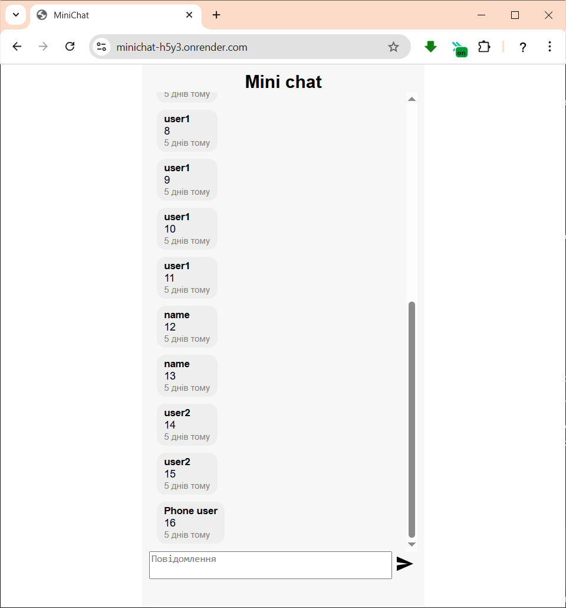

# mini-chat
MiniChat — це мінімалістичний чат, реалізований за допомогою Node.js, WebSocket і SQLite. Користувачі можуть підключатися до серверу й обмінюватись повідомленнями в реальному часі.

## Функціонал
- Обмін текстовими повідомленнями у браузері
- Підключення без авторизації
- Повідомлення зберігаються в SQLite
- Реальний час через WebSocket

https://minichat-h5y3.onrender.com

